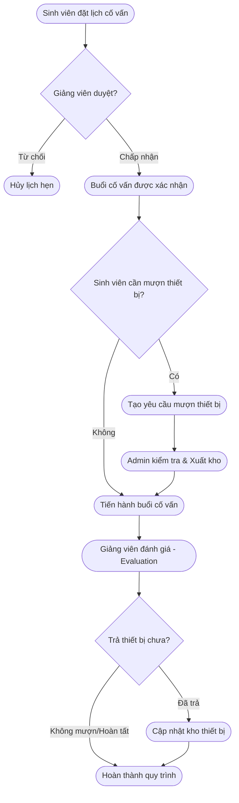
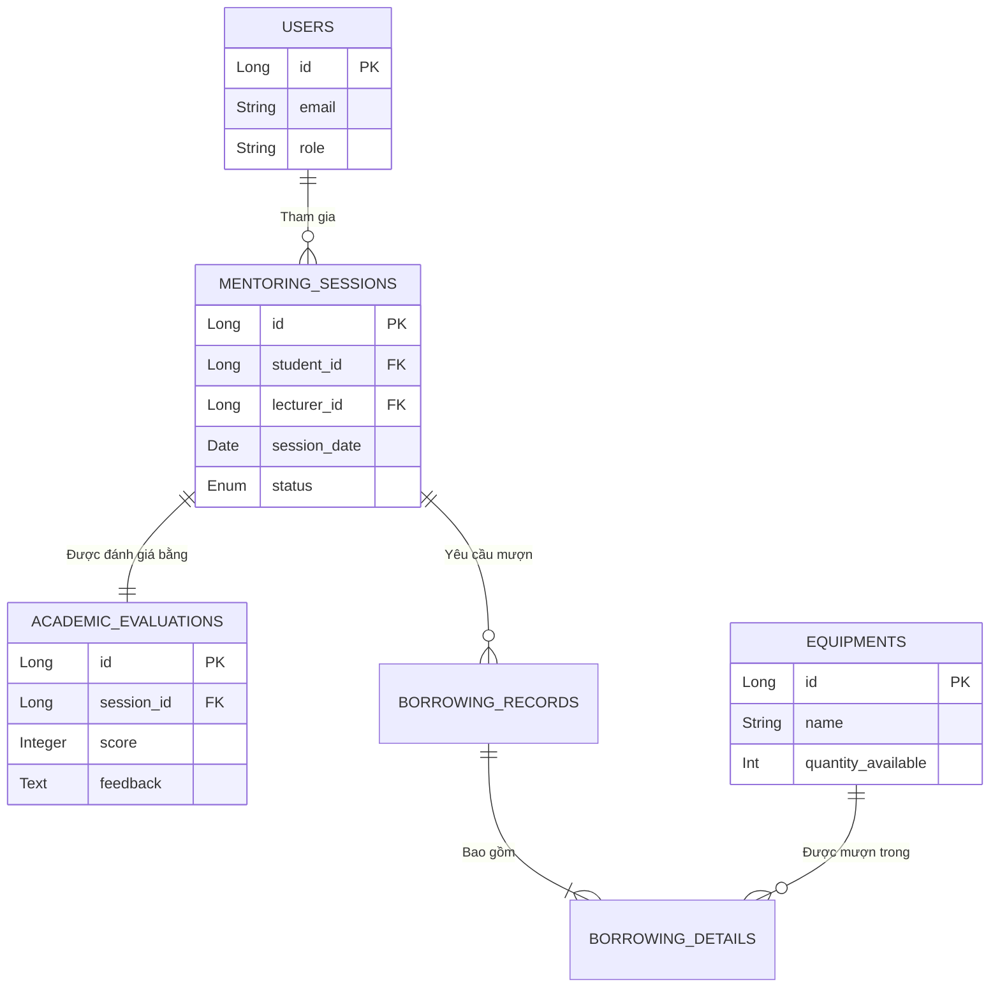

<div align="center">
  <h1>🎓 Smart Academic & Lab Support Platform (SALSP)</h1>
  <p><i>Hệ thống nền tảng hỗ trợ học thuật và quản lý thiết bị phòng thí nghiệm thông minh</i></p>
  
  
  
  
  
  
</div>

<br/>

## 📑 Mục lục
1. [Giới thiệu dự án](#1-giới-thiệu-dự-án)
2. [Kiến trúc hệ thống](#2-kiến-trúc-hệ-thống)
3. [Công nghệ sử dụng](#3-công-nghệ-sử-dụng)
4. [Chức năng theo từng vai trò](#4-chức-năng-theo-từng-vai-trò)
5. [Bảng tính năng đã hoàn thành](#5-bảng-tính-năng-đã-hoàn-thành)
6. [Tài khoản demo](#6-tài-khoản-demo)
7. [Luồng nghiệp vụ chính](#7-luồng-nghiệp-vụ-chính)
8. [Database Design](#8-database-design)
9. [Cấu trúc thư mục](#9-cấu-trúc-thư-mục)
10. [Hướng dẫn chạy project](#10-hướng-dẫn-chạy-project)
11. [Screenshots](#11-screenshots)
12. [API mẫu](#12-api-mẫu)
13. [Điểm nổi bật kỹ thuật](#13-điểm-nổi-bật-kỹ-thuật)
14. [Hướng phát triển tương lai](#14-hướng-phát-triển-tương-lai)
15. [Thành viên nhóm](#15-thành-viên-nhóm)
16. [Kết luận](#16-kết-luận)

---

## 1. 🌟 Giới thiệu dự án

**Mục tiêu hệ thống:**
Xây dựng một nền tảng tập trung, tự động hóa nhằm số hóa toàn bộ quy trình cố vấn học tập và mượn trả trang thiết bị thực hành tại trường Đại học.

**Bài toán giải quyết:**
- Giảm thiểu thủ tục giấy tờ trong việc đăng ký lịch hẹn cố vấn học tập giữa sinh viên và giảng viên.
- Số hóa quy trình quản lý kho thiết bị phòng Lab, tránh thất thoát và khó khăn trong việc theo dõi tình trạng mượn trả.
- Đảm bảo tính minh bạch thông qua hệ thống đánh giá (Evaluation) sau mỗi buổi cố vấn.

**Đối tượng sử dụng:**
- Sinh viên (Student): Cần hỗ trợ học tập, mượn thiết bị thực hành.
- Giảng viên (Lecturer): Tiếp nhận cố vấn, theo dõi tiến độ sinh viên, phê duyệt yêu cầu chuyên môn.
- Quản trị viên (Admin): Quản lý toàn bộ hệ thống, kho thiết bị và người dùng.

---

## 2. 🏗 Kiến trúc hệ thống

Dự án áp dụng kiến trúc **Spring Boot Monolithic**, được thiết kế chặt chẽ theo **Mô hình 3-Layer (3-Tier Architecture)**:

- **Controller Layer:** Tiếp nhận HTTP Request, thực hiện validate dữ liệu đầu vào và trả về View (Thymeleaf) hoặc JSON Data.
- **Service Layer:** Chứa toàn bộ Business Logic (nghiệp vụ cốt lõi), xử lý các phép toán phức tạp và quản lý **Transaction Management** (đảm bảo tính toàn vẹn dữ liệu).
- **Repository/DAO Layer:** Tương tác trực tiếp với Database thông qua Spring Data JPA và Hibernate.

**Pattern nổi bật:**
- **DTO (Data Transfer Object) Pattern:** Phân tách rõ ràng giữa Entity (chỉ dùng ở tầng Data) và DTO (trả về cho Client), bảo mật cấu trúc DB.
- **Global Exception Handling:** Gom nhóm toàn bộ lỗi thông qua `@ControllerAdvice`.

---

## 3. 🛠 Công nghệ sử dụng

| Công nghệ | Vai trò | Chi tiết |
| :--- | :--- | :--- |
| **Java 21** | Ngôn ngữ lập trình | Hỗ trợ Virtual Threads, Pattern Matching |
| **Spring Boot 3** | Backend Framework | Xây dựng REST API & Web MVC, Auto-configuration |
| **Spring Data JPA** | ORM Framework | Tương tác Database tự động qua Hibernate 6 |
| **MySQL 8.0** | Cơ sở dữ liệu | Lưu trữ dữ liệu quan hệ, đảm bảo ACID |
| **Thymeleaf** | Template Engine | Render giao diện Server-side động |
| **Bootstrap 5 / CSS3** | Frontend Styling | Thiết kế giao diện Responsive, UX/UI mượt mà |
| **Gradle** | Build Tool | Quản lý thư viện dependency và build project |

---

## 4. 👥 Chức năng theo từng vai trò

### 🎓 Sinh viên (Student)
- Đăng ký và quản lý tài khoản sinh viên.
- Tra cứu danh sách giảng viên và thiết bị khả dụng.
- Đặt lịch hẹn cố vấn học tập (Booking Mentoring Session).
- Theo dõi trạng thái đặt lịch và hủy lịch hẹn khi cần.
- Đăng ký mượn thiết bị phòng Lab dựa trên buổi cố vấn.
- Xem lịch sử học tập và lịch sử mượn trả thiết bị.

### 👨‍🏫 Giảng viên (Lecturer)
- Quản lý hồ sơ giảng viên (Bio, chuyên môn).
- Xem danh sách sinh viên đặt lịch hẹn cố vấn.
- Phê duyệt / Từ chối (Confirm / Cancel) lịch hẹn sinh viên.
- Đánh giá chất lượng sinh viên sau buổi cố vấn (Academic Evaluation).
- Cập nhật ghi chú chuyên môn cho từng buổi gặp.

### 🛡 Quản trị viên (Admin)
- Quản lý danh sách tài khoản người dùng (CRUD Users).
- Quản lý kho thiết bị phòng Lab (Nhập/Xuất kho, Theo dõi tồn kho).
- Phê duyệt các yêu cầu xuất kho thiết bị cho buổi cố vấn.
- Xem báo cáo thống kê: Số lượng đặt lịch, tình trạng kho thiết bị.

---

## 5. 📋 Bảng tính năng đã hoàn thành

| STT | Tính năng | Mô tả chi tiết | Trạng thái |
| :---: | :--- | :--- | :---: |
| 1 | **Authentication** | Đăng nhập, phân quyền role-based access | ✅ Hoàn thành |
| 2 | **Booking System** | Đặt lịch cố vấn, chống trùng lịch (Conflict Validation) | ✅ Hoàn thành |
| 3 | **Inventory Mgmt** | Quản lý kho thiết bị, locking số lượng khi mượn | ✅ Hoàn thành |
| 4 | **Evaluation** | Hệ thống đánh giá buổi học, chấm điểm (score) | ✅ Hoàn thành |
| 5 | **Transaction** | Đảm bảo tính toàn vẹn khi tạo phiếu mượn & trừ kho | ✅ Hoàn thành |
| 6 | **Dashboard** | Thống kê số lượng theo dạng biểu đồ trực quan | ✅ Hoàn thành |
| 7 | **Validation** | Kiểm tra dữ liệu hợp lệ đầu vào từ Client và Server | ✅ Hoàn thành |
| 8 | **Responsive UI** | Giao diện tương thích máy tính, máy tính bảng, điện thoại | ✅ Hoàn thành |
| 9 | **Report Thống kê** | Xuất báo cáo hoạt động học thuật theo tháng | ⚠ Đang phát triển |
| 10 | **Async Email** | Gửi email thông báo nhắc lịch tự động | ❌ Chưa làm |

---

## 6. 🔑 Tài khoản demo

Truy cập hệ thống và sử dụng các tài khoản sau để demo chức năng:

| Vai trò | Username (Email) | Password | Ghi chú |
| :--- | :--- | :--- | :--- |
| **Admin** | `admin@salsp.edu.vn` | `admin123` | Toàn quyền hệ thống |
| **Giảng viên** | `lecturer01@salsp.edu.vn` | `123456` | Giảng viên khoa CNTT |
| **Sinh viên** | `student01@salsp.edu.vn` | `123456` | Sinh viên năm 3 |

---

## 7. 🔄 Luồng nghiệp vụ chính

Dưới đây là sơ đồ quy trình từ lúc sinh viên đặt lịch đến khi hoàn thành buổi cố vấn và mượn trả thiết bị:



**Step-by-step:**
1. Sinh viên lên hệ thống chọn khung giờ trống và đặt lịch gặp Giảng viên.
2. Giảng viên nhận thông báo, tiến hành phê duyệt (Confirmed) lịch hẹn.
3. Nếu buổi gặp yêu cầu thực hành, sinh viên tạo phiếu mượn thiết bị.
4. Admin kiểm tra số lượng tồn kho (Inventory) và phê duyệt xuất kho.
5. Buổi cố vấn diễn ra. Giảng viên cập nhật điểm số (Score) và nhận xét (Feedback).
6. Sinh viên trả thiết bị, hệ thống hoàn thành vòng lặp Transaction.

---

## 8. 🗄 Database Design

Hệ thống sử dụng cơ sở dữ liệu quan hệ với các bảng cốt lõi sau:
- **`users` / `user_profiles`**: Quản lý thông tự định danh và tài khoản.
- **`mentoring_sessions`**: Lưu trữ lịch hẹn, trạng thái (PENDING, CONFIRMED...).
- **`academic_evaluations`**: Liên kết 1-1 với buổi cố vấn, lưu kết quả đánh giá học thuật.
- **`equipments`**: Master data danh mục thiết bị, số lượng khả dụng.
- **`borrowing_records` / `borrowing_details`**: Quản lý phiếu mượn (Header) và chi tiết thiết bị mượn (Line items).



---

## 9. 📁 Cấu trúc thư mục

Dự án được tổ chức chặt chẽ theo chuẩn package Spring Boot:

```text
Smart_Academic_Lab_Support_Platform/
├── src/main/java/com/rikkei/salsp/
│   ├── config/             # Cấu hình Security, WebMvc, Database
│   ├── controller/         # Xử lý HTTP Request (Web & REST)
│   ├── dto/                # Data Transfer Objects
│   ├── entity/             # Hibernate JPA Entities
│   ├── exception/          # Global Error Handlers
│   ├── repository/         # Data Access Layer (Spring Data JPA)
│   ├── service/            # Business Logic Layer
│   └── SalspApplication.java
├── src/main/resources/
│   ├── static/             # CSS, JS, Images, Bootstrap
│   ├── templates/          # Thymeleaf HTML views
│   ├── application.properties # Cấu hình project & DB
│   └── schema.sql          # SQL Script khởi tạo Database
└── build.gradle            # Cấu hình dependency
```

---

## 10. 🚀 Hướng dẫn chạy project

**Bước 1: Clone dự án về máy**
```bash
git clone https://github.com/your-username/Smart_Academic_Lab_Support_Platform.git
cd Smart_Academic_Lab_Support_Platform
```

**Bước 2: Chuẩn bị Cơ sở dữ liệu (MySQL)**
- Mở MySQL Workbench hoặc Terminal.
- Hệ thống đã tự động cấu hình `createDatabaseIfNotExist=true` trong properties, bạn chỉ cần đảm bảo MySQL đang chạy ở cổng `3306`.
- Cập nhật thông tin đăng nhập DB trong file `src/main/resources/application.properties`:
```properties
spring.datasource.username=root
spring.datasource.password=your_password
```

**Bước 3: Chạy ứng dụng qua Gradle**
```bash
./gradlew bootRun
```
*Đối với Windows:*
```cmd
gradlew.bat bootRun
```

**Bước 4: Truy cập ứng dụng**
Mở trình duyệt và truy cập: `http://localhost:8080`

---

## 11. 📸 Screenshots

*Lưu ý: Thay thế các đường dẫn hình ảnh thực tế sau khi project deploy.*

| Trang Đăng Nhập | Trang Dashboard (Thống Kê) |
| :---: | :---: |
|  |  |

| Màn Hình Đặt Lịch (Sinh Viên) | Đánh Giá Học Thuật (Giảng Viên) |
| :---: | :---: |
|  |  |

---

## 12. 🔌 API mẫu

Một số REST API chính dùng cho Ajax/Frontend xử lý bất đồng bộ:

| Method | Endpoint | Tham số | Chức năng |
| :---: | :--- | :--- | :--- |
| `GET` | `/api/v1/equipments` | `?categoryId=1` | Lấy danh sách thiết bị khả dụng |
| `POST` | `/api/v1/sessions/book` | `SessionDTO` | Tạo mới lịch hẹn cố vấn học tập |
| `PUT` | `/api/v1/sessions/{id}/confirm` | `sessionId` | Giảng viên xác nhận lịch hẹn |
| `POST` | `/api/v1/evaluations` | `EvaluationDTO` | Nộp đánh giá kết quả học thuật |

---

## 13. 💡 Điểm nổi bật kỹ thuật

1. **Transaction Management:** Sử dụng `@Transactional` khắt khe ở Service layer để đảm bảo việc trừ số lượng thiết bị (`quantity_available`) và tạo phiếu mượn diễn ra đồng bộ, tránh lỗi data (Data inconsistency).
2. **Conflict Validation:** Áp dụng thuật toán kiểm tra trùng lặp lịch biểu để ngăn chặn việc sinh viên đặt lịch trùng giờ với Giảng viên đã có lịch.
3. **Database Schema Initialization:** Kiểm soát chặt chẽ vòng đời khởi tạo bằng cấu hình `spring.jpa.defer-datasource-initialization=false` kết hợp `schema.sql`, giúp quản lý cấu trúc DB tường minh thay vì lạm dụng `ddl-auto=update`.
4. **Clean Code & DTO:** Chia tách nghiêm ngặt Entity và DTO, sử dụng MapStruct/ModelMapper để ánh xạ dữ liệu, tối ưu hóa băng thông payload.
5. **Thymeleaf Fragments:** Xây dựng giao diện hướng component (Header, Footer, Sidebar dùng chung), dễ dàng maintain.

---

## 14. 🔮 Hướng phát triển tương lai

Để mở rộng hệ thống đáp ứng quy mô toàn trường Đại học, các tính năng sau có thể được phát triển:
- **Containerization:** Đóng gói toàn bộ ứng dụng và Database bằng **Docker** & `docker-compose`.
- **JWT & Spring Security:** Áp dụng xác thực OAuth2 (Login bằng Google Mail nhà trường) và mã hóa chuỗi cấp quyền.
- **Real-time Notifications:** Tích hợp WebSocket/Redis để gửi thông báo tức thì khi trạng thái phiếu mượn thay đổi.
- **Microservices:** Tách service Inventory và Booking thành các microservice độc lập khi lượng người dùng tăng cao.
- **CI/CD Pipeline:** Triển khai tự động lên AWS/Heroku thông qua GitHub Actions.

---

## 15. 👥 Thành viên nhóm

Dự án được phân tích, thiết kế và phát triển bởi:

| Họ và Tên | MSSV | Vai trò chính |
| :--- | :--- | :--- |
| **[Tên Thành Viên 1]** | `[MSSV 1]` | Team Leader, Backend Developer (Core Architecture & DB) |
| **[Tên Thành Viên 2]** | `[MSSV 2]` | Fullstack Developer (Booking & Evaluation Module) |
| **[Tên Thành Viên 3]** | `[MSSV 3]` | Frontend Developer, Tester & UI/UX Design |

---

## 16. 🎯 Kết luận

Dự án **Smart Academic & Lab Support Platform** không chỉ là một sản phẩm thực tập/đồ án môn học, mà là một minh chứng thực tế cho việc áp dụng các tiêu chuẩn kiến trúc phần mềm chuyên nghiệp (Clean Architecture, SOLID) vào việc giải quyết một bài toán quản trị thực tế tại trường Đại học. 

Thông qua dự án, nhóm đã rèn luyện được tư duy phân tích cơ sở dữ liệu quan hệ, kỹ năng debug lỗi nền tảng Spring Framework, cũng như kinh nghiệm kiểm soát tính toàn vẹn của dữ liệu trong các nghiệp vụ phức tạp.
